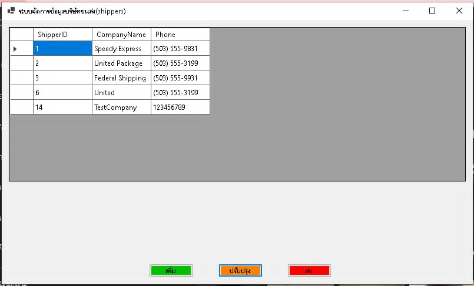
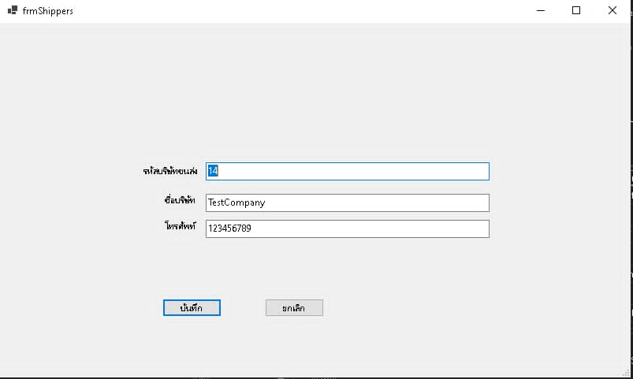

# DBMS-NortWind

<div style="display: flex; align-items: center; gap: 10px;">
  
  <span>SQL Server</span>
</div>
<div style="display: flex; align-items: center; gap: 10px;">
  
  <span>C#</span>
</div>

## หน้าหลัก 

## เมื่อกดปรับปรุง ข้อมูล



# Connect DB
``` C#
using System;
using System.Collections.Generic;
using System.Linq;
using System.Text;
using System.Threading.Tasks;
using Microsoft.Data.SqlClient;

namespace DBMS_Nortwind
{
    internal class connectDB
    {
        public static SqlConnection ConnectNortWind()
        {
            string server = @"ADM403-32\SQLEXPRESS"; //เปลี่ยนให้ตรงกับเลขเครื่อง
            string db = "Northwind";
            string strCon = string.Format(@"Data Source={0}; Initial Catalog={1};"
                      + "Integrated Security=True;Encrypt=False", server, db);
            SqlConnection conn = new SqlConnection(strCon);
            conn.Open();
            return conn;
        }
    }
}
```